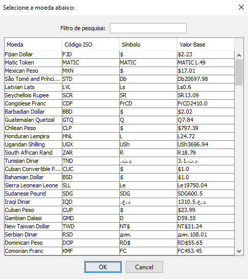
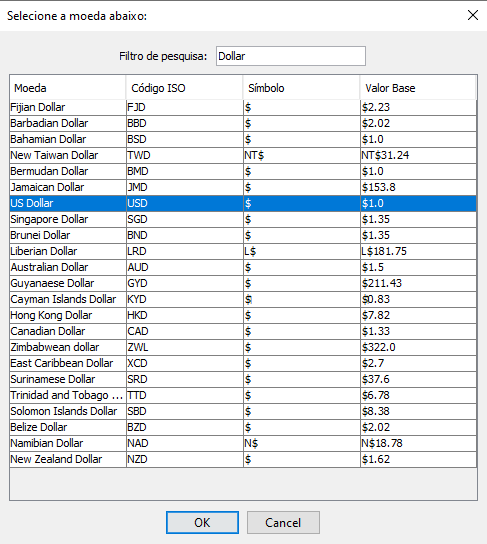

# 🎯 Oracle Next Education Challenge - Conversor

Este repositório contêm o código fonte do projeto de conversor em Java para o
Oracle Next Education. Ele é capaz de converter o valor de moedas globais e
temperaturas nas unidades mais conhecidas (Cº, Fº e K).

> Uma integração com a [CurrencyAPI](#currencyapi) pode ser
habilitada para utilizar uma maior gama de moedas no conversor monetário,
sempre atualizadas de acordo com a moeda base selecionada (que por padrão é o
USD). Verificar o tópico [Configurando a API](#configurando-a-api) para mais
informações.

---

## Utilizando o Conversor

> Para utilizar o programa, primeiro verifique se a **versão 17 ou 18** da
[Plataforma Java](https://www.oracle.com/br/java/technologies/downloads/)
está **instalada corretamente no seu computador, além das variáveis de**
**ambiente corretamente configuradas**. Outras versões do Java podem suportar
o código, porém elas não foram testadas.

### Baixando e Inicializando

A forma mais fácil de começar a usar o conversor é **instalando o arquivo JAR**
da versão mais recente dele, disponibilizada através da lista **Releases** do
GitHub.
[Você pode baixar o arquivo clicando aqui.](https://github.com/joaoiacillo/one-challenge-conversor/releases)

Por ele ser um **arquivo JAR executável**, em muitos sistemas operacionais, é
possível apenas dar um duplo clique com o botão esquerdo em cima do arquivo
e a plataforma Java irá executá-lo sem nenhum problema. 

No entanto, caso a operação acima não esteja resultando na janela principal do
programa aparecendo na tela, abra o terminal do seu sistema e navegue até a
pasta onde se localiza o arquivo executável.

Com o Java corretamente instalado, é possível inserir esse comando na janela de
comandos para executar o programa:

```bash
java -jar one-conversor-[INSIRA VERSÃO AQUI].jar
```

### Se Familiarizando com a Tela Inicial


A tela inicial do programa apresenta as duas opções de conversores a serem
escolhidas. Ao abrir qualquer um dos conversores, isto não afetara a
utilização da tela inicial, sendo possível abrir múltiplas instâncias de
conversores ao mesmo tempo.


### Conversor de Moedas

O conversor de moedas apresenta uma interface simples com:

1. Uma caixa de entrada onde se localiza o valor a ser convertido;
2. Um botão de seleção da moeda de entrada;
3. Um botão  _switch_  para alternar as moedas selecionadas de posição;
4. Um botão de seleção da moeda de saída;
5. Um botão para inicializar o processo de conversão.


> O processo de conversão ocorre de forma offline, sem utilizar qualquer API
de conversão online. Para mais informações, veja o tópico
[Como Ocorre a Conversão](#como-as-moedas-convertem).

A seleção de moeda está contida em um botão pois ao pressioná-lo, estará sendo
aberto uma janela  _modal_  com a tabela inteira de moedas disponíveis para
conversão. Em versões posteriores era utilizado uma caixa de seleção nativa
do sistema operacional, porém com a [integração da API](#configurando-a-api)
isto tornava o processo de seleção complicado. A janela seletora foi
implementada para facilitar a busca das moedas desejadas.

#### Janela Seletora de Moeda

A janela seletora apresenta uma interface simples com:

1. Uma caixa de pesquisa para filtragem de moedas;
2. Uma tabela que apresenta as seguintes informações das moedas:
    1. O nome;
    2. O código ISO (Símbolo Internacional);
    3. O símbolo nacional (Como $ para Dólar Americano);
    4. O valor base utilizado na conversão.
3. Um botão "OK" para confirmar o uso da moeda selecionada;
4. Um botão "Cancelar" para abortar a operação de seleção.

> A moeda de entrada possui uma instância da janela seletora diferente da
moeda de saída. Alterar a moeda selecionada em uma, não afetará a outra.
Isto também é verdade para cada janela de conversão de moeda.



##### Visualização Filtrada



### Conversor de Temperatura

O conversor de temperatura apresenta uma interface simples com:

1. Um grupo de seleção da temperatura inicial;
2. Uma caixa de entrada onde se localiza o valor a ser convertido;
3. Um grupo de seleção da temperatura final;
5. Um botão para inicializar o processo de conversão.


> Assim como na conversão de moedas, os valores flutuantes são arredondados
para duas casas decimais apenas após os cálculos para fácil visualização.

## Como as Moedas Convertem

O processo de conversão das moedas occore de forma offline, através de uma
fórmula matemática. O único processo que necessita de rede é a obtenção das
moedas através da CurrencyAPI caso habilitada.

A base para o cálculo é a conversão das duas moedas selecionadas para a
moeda base configurada no arquivo da API (por padrão USD).

Por exemplo,
supondo que $1 (1 USD, moeda base) são R$4,79 e €0,89, podemos fazer a
conversão de Real Brasileiro para Euro e vice-versa utilizando esses valores
convertidos.

> O valor convertido de cada moeda pode ser pré-visualizado na coluna
`Valor Base` apresentado na
[tabela seletora de moeda](#janela-seletora-de-moeda), uma vez que esse valor
já é resgatado através da API e conversões posteriores não são necessárias.

### Fórmula Utilizada

Tomando o Dolar Americano (USD) como moeda base para os cálculos:

$$
X(EUR) = V(BRL) \div 1\$(BRL) \times 1\$(EUR)
$$

> Em outras palavras, o valor em Euro é igual ao valor em Real, dividido por
1 Dolar Americano em Real, multiplicado por 1 Dolar Americano em Euro.


## CurrencyAPI

A CurrencyAPI foi implementada para expandir a capacidade do conversor
monetário. Ela disponibiliza todas as informações necessárias para seleção e
conversão das moedas.

**O uso da API não é obrigatório.** Ao não habilitar ela, um  _set_  de moedas
pré-definidas dentro do código será utilizada.

> É recomendado o uso da API pois os valores  _fallback_  pré-definidos não
são atualizados conforme a variação das moedas no mundo.

### Configurando a API

A API pode ser configurada pelo arquivo `api.config`. Ele deve ser criado na
pasta principal ( _root_ ) do projeto. A sua sintáxe é parecida com a
linguagem INI, e portanto, é fácil de editar.

> Esse arquivo não está presente no código fonte por conter informações
secretas quanto à conta utilizada para consumir a API. É preciso criar uma
conta no
[site oficial](https://currencyapi.com)
deles e gerar uma token de acesso para utilizar o serviço.

Para que o arquivo de configuração possa ser processado e utilizado pelo código
é utilizado a classe `Properties` do Java (
[Java Docs](https://docs.oracle.com/javase/8/docs/api/java/util/Properties.html)
).

As propriedades utilizadas para configuração são as seguintes:

| Propriedade         | Opcional | Descrição                                                         | Valor Padrão |
|---------------------|----------|-------------------------------------------------------------------|--------------|
| `api.enabled`       | Sim      | Habilita o uso da API caso o<br>valor `true` seja providenciado   | `false`      |
| `api.key`           | Não      | A key do serviço CurrencyAPI.                                     | `null`       |
| `api.base_currency` | Sim      | O código ISO da moeda base a ser<br>utilizada para as conversões. | `"USD"`      |


#### Exemplo de Arquivo de Configuração da API

```ini
# Habilitando o uso da CurrencyAPI
api.enabled = true
# Definindo a key de utilização da API
api.key = XXXXXXXXXXXXXXXXXXXXXXXXXXXXX
# Utilizando o Real Brasileiro como moeda base para o cálculo das conversões
api.base_currency = BRL
```

 
## Licença

Este projeto utiliza a `GNU General Public License v3.0` como principal
licença. Créditos são requeridos e o projeto que o utilizar deve ser de código
aberto. O arquivo completo pode ser visualizado
[aqui](https://github.com/joaoiacillo/one-challenge-conversor/blob/main/LICENSE).

## Contribuição

Caso tenha interesse em contribuir com o código,  _pull requests_  estão
abertas e eu agradeceria muito pela ajuda. 😄