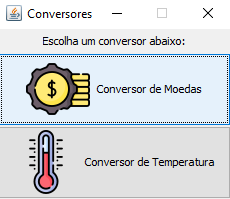
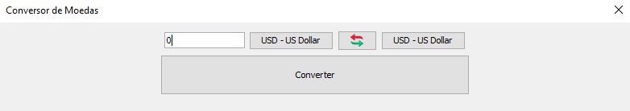
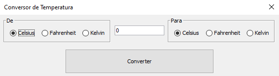

# 🎯 Oracle Next Education Challenge - Conversor

_Esse repositório contém o código fonte para o desafio Decodificador de Texto
da formação Iniciante em Programação do Oracle ONE._

## Screenshots

### Seletor de Conversores



### Conversor de Moedas



### Conversor de Temperatura



## Configurando a API

A API é configurada através do arquivo `api.config` que fica localizado na
pasta principal (root) do projeto.

O arquivo utiliza uma sintaxe estilo INI e utiliza as seguintes
propriedades:

 - `api.enabled` → Habilita o uso da API caso o valor `true` seja providenciado.
 - `api.key` → A key do serviço CurrencyAPI: [currencyapi.com](currencyapi.com).
 - `api.base_currency` [Opcional] → O código ISO da moeda base a ser utilizada para as conversões. (Padrão: USD)
 
**Exemplo de arquivo:**

```ini
# Habilitando o uso da CurrencyAPI
api.enabled = true
# Definindo a key de utilização da API
api.key = XXXXXXXXXXXXXXXXXXXXXXXXXXXXX
# Utilizando o Real Brasileiro como moeda base para o cálculo das conversões
api.base_currency = BRL
```

 